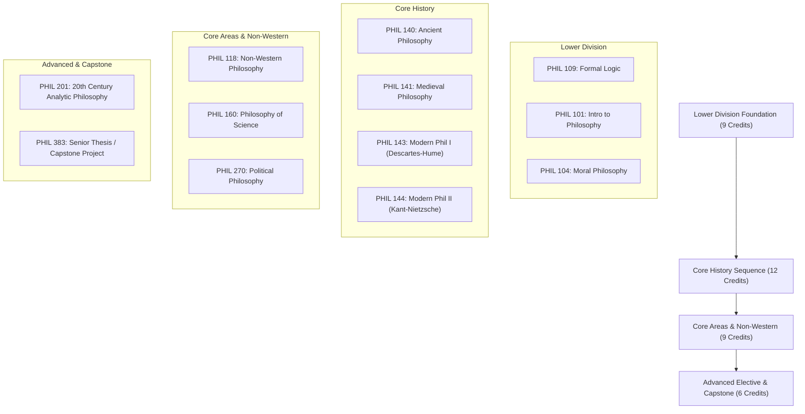

# NoPayBA: Bachelor of Arts in Philosophy Blueprint
*Modeled after Queens College (CUNY) B.A. in Philosophy (36 Credits / 12 Courses)*

> [!NOTE]
> All primary texts linked below are **100% free and in the public domain** (formatted beautifully by Standard Ebooks, Project Gutenberg, or Internet Archive). All secondary textbooks and lecture series are **Open Access / OER**.

---

## Degree Structure Overview

---

## Detailed Course Catalogue & Reading Lists

### 1. PHIL 109: Formal Logic
*Equivalency: Queens College PHIL 109 (3 Credits)*  
*Focus: Deduction, truth tables, natural deduction, and propositional/predicate logic.*

* **Primary Textbook**: [forall x: Calgary Edition](https://forallx.openlogicproject.org/) by P.D. Magnus & Tim Button (Free Open Logic PDF/ePub/HTML)
* **Lecture Course**: [MIT OpenCourseWare: Logic I (24.241)](https://ocw.mit.edu/courses/24-241-logic-i-fall-2009/) (MIT Open Access Curriculum & Lecture Notes)
* **Supplementary Textbook**: [Fundamental Methods of Logic](https://wisconsin.pressbooks.pub/logicfundamentals/) by Matthew Knachel

---

### 2. PHIL 140: History of Ancient Philosophy
*Equivalency: Queens College PHIL 140 (3 Credits)*  
*Focus: Presocratics, Socrates, Plato, Aristotle, and Hellenistic Philosophy.*

* **Primary Texts**:
  * Plato: [*The Apology* & *Crito of Socrates*](https://www.gutenberg.org/ebooks/13726) (Project Gutenberg)
  * Plato: [*The Republic*](https://www.gutenberg.org/ebooks/1497) (Project Gutenberg)
  * Aristotle: [*Nicomachean Ethics*](https://standardebooks.org/ebooks/aristotle/nicomachean-ethics/f-h-peters) (Standard Ebooks)
  * Lucretius: [*On the Nature of Things*](https://standardebooks.org/ebooks/lucretius/on-the-nature-of-things/william-ellery-leonard) (Standard Ebooks)
* **Lecture Course**: [Yale Open Courses: Introduction to Political Philosophy (PLSC 114)](https://oyc.yale.edu/political-science/plsc-114) (Prof. Steven B. Smith, covers Plato & Aristotle's core texts)
* **Audio Companion**: [History of Philosophy Without Any Gaps: Classical Greek Philosophy](https://historyofphilosophy.net/series/classical-greek-philosophy) (Peter Adamson)

---

### 3. PHIL 141: History of Medieval & Renaissance Philosophy
*Equivalency: Queens College PHIL 141 (3 Credits)*  
*Focus: Christian, Islamic, and Jewish scholastic traditions.*

* **Primary Texts**:
  * Augustine: [*Confessions*](https://www.gutenberg.org/ebooks/77585) (Project Gutenberg)
  * Anselm of Canterbury: [*Proslogion*](https://www.openphilosophytexts.com/anselm-proslogion) (Open Philosophy Texts)
  * Thomas Aquinas: [*Summa Theologiae (First Part)*](https://www.gutenberg.org/ebooks/17611) (Project Gutenberg)
  * Moses Maimonides: [*The Guide for the Perplexed*](https://www.gutenberg.org/ebooks/73584) (Project Gutenberg)
* **Lecture Series**: [History of Philosophy Without Any Gaps: Medieval Europe & Islamic World](https://historyofphilosophy.net/series/islamic-world-medieval-europe)

---

### 4. PHIL 143: History of Modern Philosophy I (Rationalism & Empiricism)
*Equivalency: Queens College PHIL 143 (3 Credits)*  
*Focus: 17th–18th century European philosophy from Descartes to Hume.*

* **Primary Texts**:
  * René Descartes: [*Meditations on First Philosophy*](https://dn760000.eu.archive.org/0/items/RMCG0002/Descartes-Meditations-a1.pdf)(Internet Archive)
  * Benedictus de Spinoza: [*Ethics*](https://www.gutenberg.org/ebooks/3800]) (Project Gutenberg)
  * John Locke: [*An Essay Concerning Human Understanding*](https://www.gutenberg.org/ebooks/10615) (Project Gutenberg)
  * David Hume: [*An Enquiry Concerning Human Understanding*](https://standardebooks.org/ebooks/david-hume/an-enquiry-concerning-human-understanding) (Standard Ebooks)
* **Lecture Course**: [Oxford Podcasts: General Philosophy](https://podcasts.ox.ac.uk/series/general-philosophy) (Prof. Peter Millican, Oxford University)

---

### 5. PHIL 144: History of Modern Philosophy II (Kant to Nietzsche)
*Equivalency: Queens College PHIL 144 (3 Credits)*  
*Focus: German Idealism, Utilitarianism, and 19th Century Existentialism.*

* **Primary Texts**:
  * Immanuel Kant: [*Critique of Pure Reason*](https://www.gutenberg.org/ebooks/4280) (Project Gutenberg)
  * G.W.F. Hegel: [*The Philosophy of Mind*](https://www.gutenberg.org/ebooks/39064) (Project Gutenberg)
  * John Stuart Mill: [*Utilitarianism*](https://standardebooks.org/ebooks/john-stuart-mill/utilitarianism) (Standard Ebooks)
  * Friedrich Nietzsche: [*Beyond Good and Evil*](https://standardebooks.org/ebooks/friedrich-nietzsche/beyond-good-and-evil/helen-zimmern) (Standard Ebooks)
* **Lecture Series**: [Yale Open Courses: Philosophy and the Science of Human Nature (PHIL 181)](https://oyc.yale.edu/philosophy/phil-181) (Prof. Tamar Gendler, covers Kant & Mill)

---

### 6. PHIL 104: Ethics & Moral Philosophy
*Equivalency: Queens College PHIL 104 (3 Credits)*  
*Focus: Normative ethics, metaethics, and moral reasoning.*

* **Primary Texts**:
  * Aristotle: [*Nicomachean Ethics*](https://standardebooks.org/ebooks/aristotle/nicomachean-ethics/f-h-peters)
  * Immanuel Kant: [*Fundamental Principles of the Metaphysic of Morals*](https://www.gutenberg.org/ebooks/5682)
  * John Stuart Mill: [*Utilitarianism*](https://standardebooks.org/ebooks/john-stuart-mill/utilitarianism)
* **Open Textbook**: [Ethics for A-Level / Introductory Ethics](https://human.libretexts.org/Bookshelves/Philosophy/Ethics_(Fisher_and_Dimmock)) by Mark Dimmock & Andrew Fisher
* **Lecture Course**: [Yale Open Courses: Philosophy and the Science of Human Nature (PHIL 181)](https://oyc.yale.edu/philosophy/phil-181) (Prof. Tamar Gendler, Yale University)

---

### 7. PHIL 118: World & Non-Western Philosophy (Asian, Indian, Buddhist)
*Equivalency: Queens College PHIL 118 (3 Credits)*  
*Focus: Classical Chinese (Confucian, Daoist), Indian (Vedic, Hindu), and Buddhist philosophical traditions.*

* **Primary Texts**:
  * Confucius: [*The Analects*](https://standardebooks.org/ebooks/confucius/the-analects/william-edward-soothill) (Standard Ebooks)
  * Laozi: [*Tao Te Ching*](https://standardebooks.org/ebooks/laozi/tao-te-ching/james-legge) (Standard Ebooks)
  * Anonymous: [*The Dhammapada*](https://www.gutenberg.org/ebooks/2017) (Project Gutenberg - Foundational Buddhist Text)
  * Anonymous: [*The Bhagavad Gita*](https://standardebooks.org/ebooks/sir-edwin-arnold/the-song-celestial) (Standard Ebooks)
* **Dedicated Lecture Series (Indian & Buddhist Philosophy)**: [History of Philosophy Without Any Gaps: Classical Indian Philosophy](https://historyofphilosophy.net/india) (Prof. Peter Adamson & Prof. Jonardon Ganeri, King's College London / Oxford)

---

### 8. PHIL 160: Philosophy of Science & Epistemology
*Equivalency: Queens College PHIL 160 (3 Credits)*  
*Focus: The scientific method, falsifiability, induction, and scientific realism.*

* **Primary Texts**:
  * Francis Bacon: [*Novum Organum*](https://www.gutenberg.org/ebooks/45988) (Project Gutenberg)
  * Henri Poincaré: [*Science and Hypothesis*](https://www.gutenberg.org/ebooks/37157) (Project Gutenberg)
  * Karl Pearson: [*The Grammar of Science*](https://archive.org/details/grammarofscience00pearrich) (Internet Archive)
* **Open Course / Reading**: [Stanford Encyclopedia of Philosophy: Scientific Realism](https://plato.stanford.edu/entries/scientific-realism/)

---

### 9. PHIL 270: Political and Social Philosophy
*Equivalency: Queens College PHIL 270 (3 Credits)*  
*Focus: Justice, social contract theory, liberty, and rights.*

* **Primary Texts**:
  * Thomas Hobbes: [*Leviathan*](https://standardebooks.org/ebooks/thomas-hobbes/leviathan) (Standard Ebooks)
  * John Locke: [*Second Treatise of Government*](https://standardebooks.org/ebooks/john-locke/second-treatise-of-government) (Standard Ebooks)
  * Jean-Jacques Rousseau: [*The Social Contract*](https://standardebooks.org/ebooks/jean-jacques-rousseau/the-social-contract/g-d-h-cole) (Standard Ebooks)
  * John Stuart Mill: [*On Liberty*](https://standardebooks.org/ebooks/john-stuart-mill/on-liberty) (Standard Ebooks)
* **Lecture Course**: [Yale Open Courses: Moral Foundations of Politics (PLSC 118)](https://oyc.yale.edu/political-science/plsc-118) (Prof. Ian Shapiro, Yale)

---

### 10. PHIL 201: 20th Century Analytic Philosophy
*Equivalency: Queens College 20th Century Requirement (3 Credits)*  
*Focus: Language, pragmatism, logicism, and early 20th-century analytic thinkers.*

* **Primary Texts**:
  * Bertrand Russell: [*The Problems of Philosophy*](https://standardebooks.org/ebooks/bertrand-russell/the-problems-of-philosophy) (Standard Ebooks)
  * William James: [*Pragmatism*](https://standardebooks.org/ebooks/william-james/pragmatism) (Standard Ebooks)
  * Gottlob Frege: [*The Foundations of Arithmetic*](https://archive.org/details/foundationsofari0000freg) (Internet Archive)
  * Ludwig Wittgenstein: [*Tractatus Logico-Philosophicus*](https://www.gutenberg.org/ebooks/5740) (Project Gutenberg)
* **Reference**: [Stanford Encyclopedia of Philosophy: Analytic Philosophy](https://plato.stanford.edu/entries/analysis/)

---

### 11. PHIL 220: Epistemology & Metaphysics Elective
*Equivalency: Queens College Upper-Division Elective (3 Credits)*  
*Focus: Theories of perception, justification, skepticism, and knowledge acquisition.*

* **Primary Texts**:
  * George Berkeley: [*A Treatise Concerning the Principles of Human Knowledge*](https://standardebooks.org/ebooks/george-berkeley/a-treatise-concerning-the-principles-of-human-knowledge) (Standard Ebooks)
  * Gottfried Wilhelm Leibniz: [*Monadology*](https://www.gutenberg.org/ebooks/39441) (Project Gutenberg)
  * René Descartes: [*Discourse on the Method*](https://www.gutenberg.org/ebooks/59) (Project Gutenberg)
* **Dedicated Epistemology Textbook**: [*Introduction to Philosophy: Epistemology*](https://open.umn.edu/opentextbooks/textbooks/1069) edited by Brian C. Barnett & Christina Hendricks (University of Minnesota Open Textbook Library)
* **Reference & Topic Guide**: [Stanford Encyclopedia of Philosophy: Epistemology](https://plato.stanford.edu/entries/epistemology/)

---

### 12. PHIL 383: Senior Capstone Thesis & Independent Research
*Equivalency: Queens College PHIL 383 (3 Credits)*  
*Focus: Independent research paper (15–20 pages) applying critical philosophical methodology.*

* **Core Research Repositories**:
  * [Stanford Encyclopedia of Philosophy (SEP)](https://plato.stanford.edu/) - Peer-reviewed academic entries
  * [Internet Encyclopedia of Philosophy (IEP)](https://iep.utm.edu/) - Peer-reviewed general philosophical encyclopedia
  * [PhilPapers Open Access Archive](https://philpapers.org/) - Comprehensive bibliography & open access repository
* **Suggested Thesis Prompts**:
  1. *Epistemology*: Compare Hume's problem of induction with Popper's falsificationism.
  2. *Ethics*: Evaluate Kant's Categorical Imperative against Mill's Rule Utilitarianism in modern medical dilemmas.
  3. *Political Philosophy*: Contrast Hobbes's state of nature with Rousseau's social contract regarding human liberty.
  4. *21st Century Applciation*: How does modern technological advancement in medicine, psychology etc. prove or disprove Tabula Rasa?

---

> [!TIP]
> **Free Reading Tools**: We recommend reading all `.epub` links using open-source readers like [Calibre](https://calibre-ebook.com/) or reading directly in web format on Standard Ebooks.
